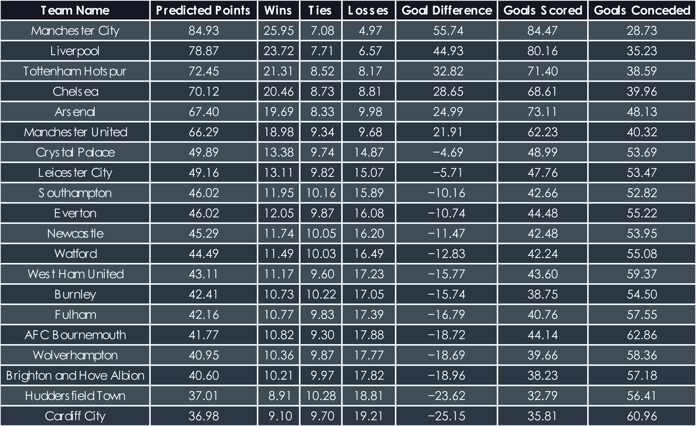
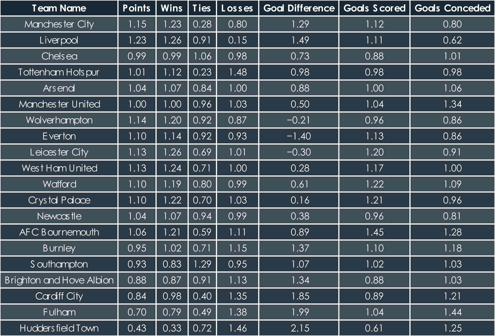
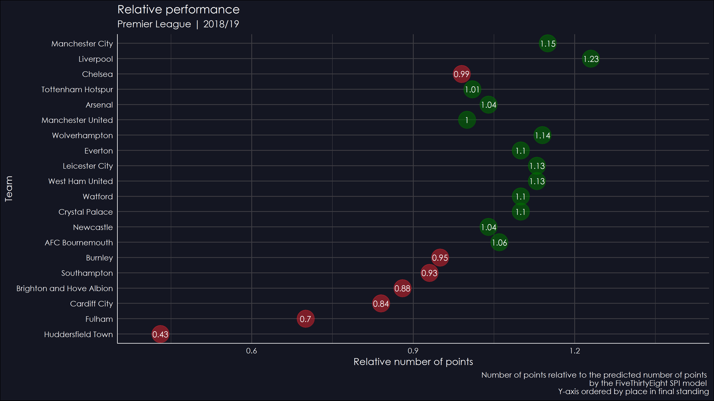
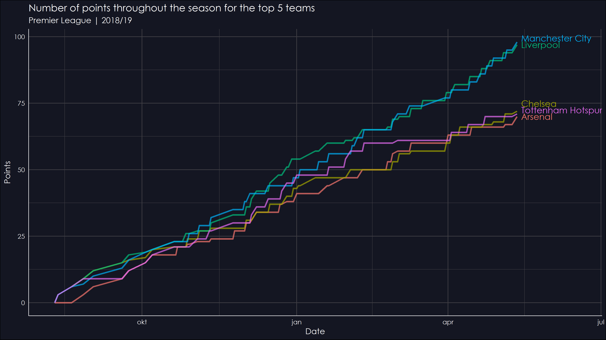
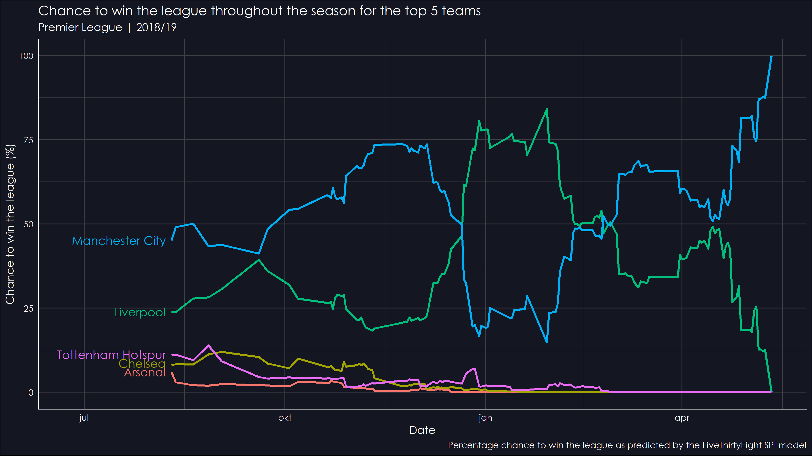
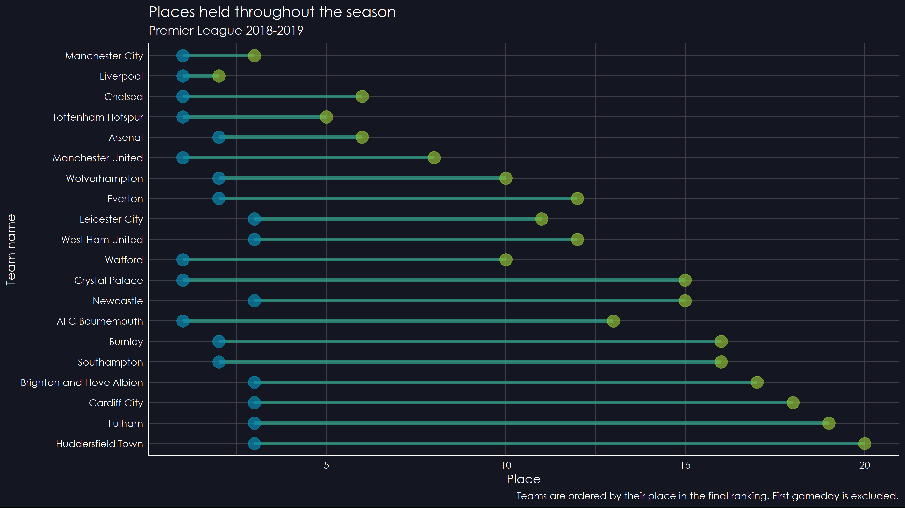

# FiveThirtyEight Soccer Predictions

This repository contains data with an analysis about the [Club Soccer Predictions by FiveThirtyEight](https://projects.fivethirtyeight.com/soccer-predictions/).
For more information about the soccer predictions and the SPI model created by FiveThirtyEight used to make the predictions, check out FiveThirtyEight's [methodology page](https://fivethirtyeight.com/methodology/how-our-club-soccer-predictions-work/).

## Data
Historical data ranges from season 2016/17 (depending on league) to 2018/19. Daily data is available starting from 11-10-2019 until 11-6-2019.
All data was retrieved directly from the FiveThirtyEight API which returns json objects. 
A json dictionary is present in the `data` folder. Both the `historical_data.py` and `current_data.py` scripts were used to retrieve the data, the first one to retrieve all historical data (data saved before today), the second one to get the current data every day. 
The second script ran daily on a Raspberry Pi 3 using a cron job.
Club logos were scraped from the ESPN website using the `download_logos.py` script. 

Data for the following competitions was gathered:

* Champions League
* Europa League
* Austrian Football Bundesliga
* Belgian First Division A
* Superligaen
* Premier League
* Championship
* League One
* League Two
* Ligue 1
* Ligue 2
* Bundesliage
* 2\. Bundesliga
* Super League Greece
* Serie A
* Serie B
* Eredivisie
* Eliteserien
* Primeira Liga
* Russian Premier League
* Premiership
* La Liga
* La Liga 2
* Allsvenskan
* Super League
* Süper Lig

## Folder structure
```
    .
    ├── data                   # Gathered data
    ├── images                 # Plots and tables
    ├── logos                  # Club logos
    ├── scripts                # Scripts for data gathering and analysis
    ├── LICENSE
    ├── requirements.txt
    └── README.md
```

## Installation
1. Clone this repository
2. Create a virtual environment
3. Activate the virtual environment
4. Install dependencies from `requirements.txt`

## Analysis
Plots and tables were creating using the `analysis.R` script, after which they were edited using Inkscape. The images below show some of the plots and tables created. For all plots and tables check out the `images` folder.

### Predicted league table


### Relative performance (actual vs. predicted)




### Points total (top 5)


### Percentage chance to win the league (top 5)


### Positions held throughout the season

